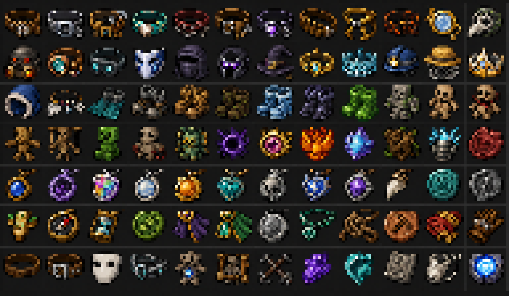

# Dorios' Trinkets — grade visual conceitual 16×16

Esta grade reúne os 84 itens propostos no plano de expansão: 72 equipáveis e 12
materiais. Ela serve como direção visual, não como aprovação automática da arte
final.

## Arquivos

- [Sprite sheet nativa](./assets/trinkets-item-visual-grid/trinkets-item-concepts-16x16.png):
  `192×112`, formada por `12×7` células; cada arte ocupa exatamente `16×16`.
- [Prévia 8×](./assets/trinkets-item-visual-grid/trinkets-item-concepts-preview-8x.png):
  `1536×896`, ampliada somente com nearest-neighbor.
- [Prancha conceitual original](./assets/trinkets-item-visual-grid/trinkets-item-concepts-source.png):
  preserva mais detalhes para orientar uma futura revisão manual.
- [Prompt final](./assets/trinkets-item-visual-grid/generation-prompt.md): especificação
  usada na geração por imagem, incluindo a ordem das 84 células.

## Mapa das células

A numeração segue da esquerda para a direita e de cima para baixo.

| Linha | Células | Categoria predominante | Itens, em ordem |
| ---: | --- | --- | --- |
| 1 | 1–12 | belts e face | Lantern Belt; Magnetic Girdle; Miner's Tool Belt; Tideforged Girdle; Bloodbound Sash; Toolwright Belt; Soulcatcher Belt; Hunter's Bandolier; Builder's Harness; Magma Cinch; Marksman's Monocle; Plague Doctor Mask |
| 2 | 13–24 | face e hat | Ember Respirator; Prospecting Lens; Echo Visor; Mirror Mask; Veil of Silence; Ender Visor; Witch's Crooked Hat; Paladin Circlet; Tideforged Crown; Miner's Helmet; Beekeeper's Hat; Crown of Last Light |
| 3 | 25–36 | hat, feet e doll | Stormcaller Hood; Featherstep Anklets; Tidewalker Fins; Sabaton Weights; Sandstrider Boots; Rootwalker Sandals; Frostwalker Soles; Shadowstep Greaves; Slimebound Boots; Stone Guardian Doll; Hollow Doll; Lucky Ragdoll |
| 4 | 37–48 | doll e archaic charm | Straw Effigy; Marionette of Spite; Creeper Doll; Leech Doll; Guardian Effigy; Void Covenant; Endless Eye; Phoenix Ash Sigil; Chronoshard; Worldroot Knot; Stormbound Idol; Glutton's Seal |
| 5 | 49–60 | amulet e talisman | Lapis Focus; Geode Amulet; Prismatic Aegis; Moonstone Amulet; Sunstone Amulet; Echoheart Amulet; Gravekeeper Amulet; Tempest Heart Amulet; Wardstone; Hunter's Fang; Ocean Coin; Quarry Sigil |
| 6 | 61–72 | talisman e acessórios gerais | Totem of Momentum; Wayfinder Compass; Stormglass Talisman; Harvester's Token; Traveler's Cloak Pin; Alchemist's Cloak Pin; Iron Locket; Emerald Chain; Wayfarer's Knot; Miner's Token; Duelist Wraps; Builder's Glove |
| 7 | 73–84 | materiais | Empty Belt; Reinforced Belt; Blank Mask; Enchanted Visor Frame; Porcelain Doll Core; Bound Doll Frame; Archaic Binding; Attunement Shard; Trinket Fragment; Stat Inscription; Cleansing Thread; Resonance Core |

## Direção para acabamento

- preservar uma silhueta reconhecível a 100% de escala, sem depender de brilho;
- usar transparência real nas texturas finais, removendo o fundo escuro conceitual;
- limitar cada PNG final a `16×16`, sem antialiasing ou redimensionamento filtrado;
- manter cintos, itens de face, hats, footwear, dolls, amulets e talismans com
  linguagens de forma distintas;
- revisar os sprites individualmente antes de movê-los para `RP/textures/items`;
- tratar a prancha como exploração de formas: detalhes perdidos na redução devem
  ser redesenhados à mão, não reintroduzidos em resolução maior.

## Reprodução

O script [`tools/build_item_visual_grid.py`](../tools/build_item_visual_grid.py)
recorta a prancha em `12×7`, normaliza cada célula para `16×16` e gera a prévia
8× com nearest-neighbor. Ele requer Pillow e recebe o caminho da prancha e o
diretório de saída como argumentos.
